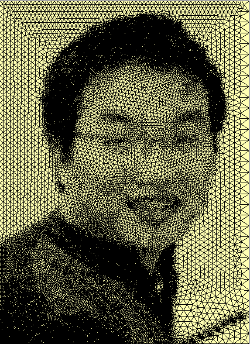

# Julin Shan 

Birth Location:  **Tongzhou, Jiansu **  **Nationality: ** China	

E-mail:    sjulin@qq.com   

Cell phone:   **18939877005** 

Current residency:   **Shanghai, China**

Current Position: CTO of Simright.com

## Experience

Oct 2018 - Present

**上海数巧信息科技有限公司**

职位: CTO

职位描述：

- 公司技术人员的招聘、培训与管理

- 有限元仿真云平台业务核心模块的研发、客户谈判、技术指导和对接

- 电磁分析中网格生成项目的核心算法开发、算法使用过程的客户培训等

- 手机跌落分析中的网格生成项目的核心算法开发。

 

### May. 2018 - Oct.2018

**Company  Alibaba Group  http://www.alibaba.com/

**Location:** Hangzhou, China

**Title**: Senior Technical Specialist (P8)

**Job Description**

- Cloth simulation Algorithm ,focus on collision detection and response

### Oct2014-May. 2018

Company:  Autodesk (China) Software Research and Development Co.,Ltd. http://www.autodesk.com

**Location:** Shanghai China

**Title****:** Principal Engineer

**Job Description:**

- Software development on FEM meshing algorithm as below

  - **Shell mesh imprint**. It’s used to generate the conformal shell between different parts in an assemble model.
  - **Shrink-wrap mesher**. A rapid shell and solid mesh generator for CAD/STL input with dirties.
  - CAD **surface mesh generation** for FEA, I developed a general surface mesher using
  - Sub-mapping and Delaunay-AFT algorithms in Autodesk Simulation Mechanical.
  - Hex-domain mesh generation algorithm by mapping method.
  - Make a mesher Automation framework by python

- Mesher as a service(WebMesher)

  - Export most meshing APIs as "C" and call them by python
  - Dcokerlize the mesher and make it as a web service
  - Implement a WebMesher prototype by ThreeJs and NodeJs
  - Dockerlize the linux build mechine.

## Aug2012-Oct 2014

**Company:** Altair Engineering (China), Inc. 

**Location:** Shanghai China

**Title**:** **Technical specialist,** **HyperMesh** **,Altair(**[http://www.altair.com](http://www.altair.com/)**)** 

**Job Description**

- Overseeing the mesher development team in China office;
-  Recruiting, training, team building and management;
-  Software development on FEM meshing algorithm as below
	1. Multithreaded tetra mesher**, I extended the tetra mesher to support run in multi-thread and out-of-core. Depends of the cases, on an eight threads PC, for most of the large models, it was speeded up 3~5 times than running in serialization. By using out-of-core technology, very large models can also be meshed on a memory shortage machine by our new tetra mesher.**
    2. **STL-like triangle mesh adaptive.** it's a mesh to better mesh algorithm. Based on my old triangle re-mesh codes which is used in tetra mesh re-meshing, I enhanced it to make it suitable for high skew triangle mesh like STL(Stereolithography). this part of codes are widely used in other models like mesh imprint and surface wrapper.   

- Enhance the tetra mesher codes
- Surface re-mesh/refinement and imprint for 3D solid meshing. It's a tool that widely used in engine and powertrain local solid re-mesh by replacing some old shell mesh attached by solid elements with the new one. It's also used in imprinting the border of CFD boundary layer mesher.

 

## **July 2007 - Aug** **2012**

**Company:** Altair Engineering, Inc. 

**Location:** Troy, MI,USA

**Position:** Senior Software Developer of HyperMesh Core 

**Job Description**: 

As a member of core developer team, I involved in an agile, fast paced meshing group that produces best-in-class mesh generation software that supports the Hyperworks line of engineering simulation. The projects I finished and on developing include the following meshing algorithms design and coding.

- Adaptive 3D tetra mesher. In this project, I solved the issue of boundary recovery which is the main reason of failure in previous version. Academically, it's also one of the most difficult part of tetra mesher; This project uses a new compatible data structure for holding huge mesh which was designed and implemented by me. 
- Tetra-mesh improvements which include sliver fixing, cleanup and local refinement. After this project, the issue of sliver tetras was solved. By adding the algorithm of boundary shell mesh cleanup and re-meshing, the quality of tetra grid was improved greatly. Some user specified functionalities such as local refinement by boxes, frustum, ellipsoid, free shapes, etc. anchor nodes/edges imprinting were also added.

**Software Environment:**	Windows /Linux/Mac

**Development Tools:**	C/C++, Tcl/Tk, OpenGL

 

### Other Professional experiences

- 07/2003~10/2006 Developed the FEA software AdoptSmart, in charge of meshing algorithm. I developed a general surface mesher using Delaunay-AFT algorithm. I also added a common geometry interface, so my mesher can be a plug-in of other commercial CAD systems. it was used in various projects of my PhD director. In these projects, I made mesher adaptors like Opencascade, Parasolid, Object-ARX,etc.

- 02/2006~12/2006 Developed the surface meshing algorithm for KMAS® which is used in Automobile Body and Die Engineering.

- 02/2006~12/2006 Developed the adaptive meshing algorithm of sheet forming and fatigue damage simulation for the Group of Mechanics, Materials & Structures(GMMS), University of Remis, France. this project was supported by the **Burse of Eiffel Doctorat**

 

 

 

### Publications

**[1].** **J.L.Shan**, Y.M. Li, Y.Q. Guo. A Robust Backward Search Method based on Walk-through for Point Location on 3D Surface Mesh. International Journal for Numerical Methods in Engineering, Feb 2008 73(8),1061-1076.

[2]. Z.Q Guan, **J.L. Shan**, Y.Zheng, Y.X.Gu. An Extended Advancing Front Technique for Closed Surface Mesh Generation. International Journal for Numerical Methods in Engineering. April 2008 74(4),642-667

**[3].** **J.L.Shan**, Z.Q.Guan, C Song, Y.X. Gu. A Reliable and Effective Tetrahedral Meshing Algorithm. Chinese Journal of Computers. Nov 2007, 30(11) 1989-1997

[4]. M.Dong, K. Debray, **J.L.Shan**,Y Q Guo. Design and Optimization of Addendum Surfaces in Sheet Metal Forming Process. International Journal for Computational Methods in Engineering Science and Mechanics,2007,8(4) 211-222   

[5]. Z. Q. Guan, **J.L.Shan** , Y. X. Gu. Surface Mesh Generation Based on Riemannian Metric. Chinese Journal of Computers. 2006:29(10), 1423-1433. 

[6]. Z. Q. Guan, **J.L.Shan** , Y. X. Gu. All hexahedron mesh generation for 3D solid model based on the extended transform templates. Chinese Journal of Computational Mechanics, Vol.11, No.1 January 2005

**[7].** **J.L.Shan** , Z. Q. Guan, Y. X. Gu. Common Geometry Interface for Mesh Generation(CGIM) COMPUTATIONAL MECHANICS WCCM VI in conjunction with APCOM’04, Beijing, China 2004,  Tsinghua University Press & Springer-Verla.

[8]. Z. Q. Guan, **J.L.Shan** , Y. X. Gu. An Object-Oriented Description of Finite Element Model Based on CAD Platform Journal of Jilin University Engineering and Technology Edition, Vol.33, No.8, September 2003. 

 